# LibroPanel

## API service for library management.


LibroPanel - allows staff to manage the book collection and lets customers borrow and return books, as well as make payments for borrowing and overdue fees. The service also integrates with a Telegram bot to send notifications.

### Technologies
- Django, Django REST Frameworks.
- PostgreSQL.
- Docker, Docker Compose.
- Swagger, Redoc.
- Selery (Distributed Task Queue).
- Redis.
- Stripe (Payment Processing).
- Telegram API.


<br>

## 🍿 &nbsp; YouTube Overview
### <a href="https://youtu.be/91DA3AnbIDQ" target="_blank">Watch demo video</a>


<br>


## 📦 &nbsp; Installation with Docker

> **Important:**  Make sure [Docker](https://www.docker.com/) is installed and running.

1. Set up environment variables:
   - Create a `.env` file.
   - Copy the content from `.env.sample` to `.env`.
   - Update the values in `.env` with your specific configuration.


2. Build and start the Docker containers:
    ```shell
    docker-compose up -d --build
    ```
   
3. Create a `superuser` account to access LibroPanel:
   ```shell
     docker-compose exec app python manage.py createsuperuser
   ```
    Follow the prompts to set email, and password.


4. Run tests:
    ```shell
    docker-compose run app sh -c "python manage.py test"
   ```
<br>

## 🔑 &nbsp; Getting Access

Use the `/api/users/token/` endpoint to obtain access token.

The access token can be used in [Postman](https://www.postman.com/) or with the [ModHeader](https://chromewebstore.google.com/detail/modheader-modify-http-hea/idgpnmonknjnojddfkpgkljpfnnfcklj?hl=en) extension for Google Chrome.

**ModHeader Example:**<br>
Replace `<your token>` with your access token.<br>


<br>

## 🗓️ &nbsp; Periodic Task Scheduling

1. Login to `/admin/` panel with your superuser account.


2. Select `Add` Periodic tasks.

    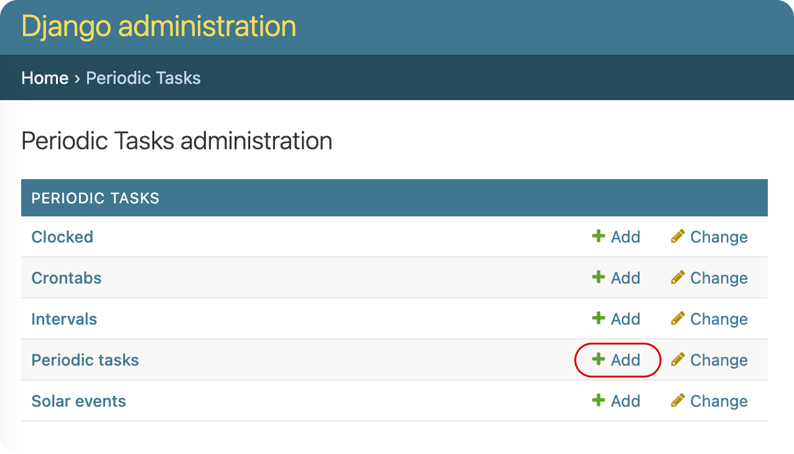


3. Write a task `Name` and choose `borrowings.tasks.expired_sessions_check_task`.

    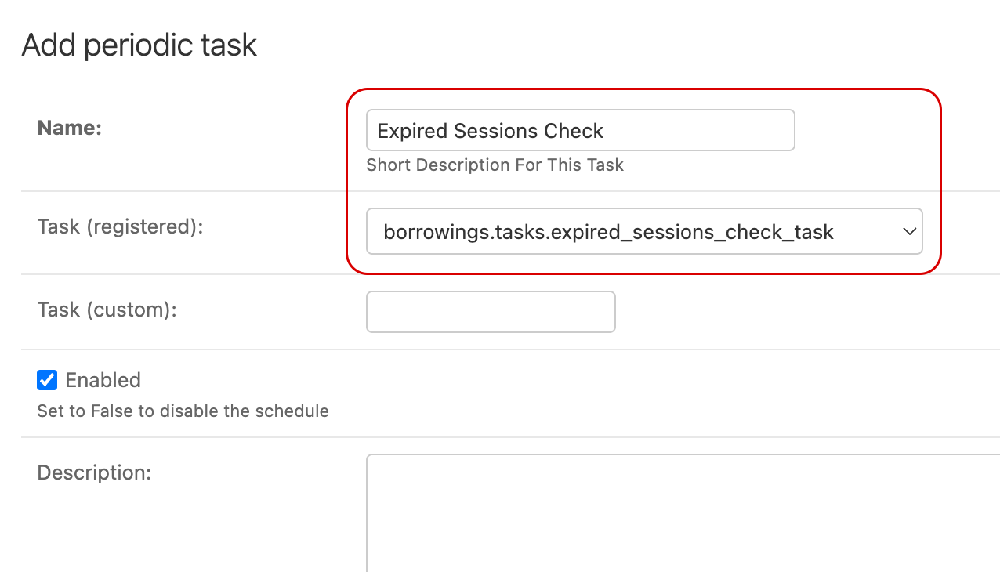


4. Add Interval. `1 minute` for `expired_sessions_check_task`.

    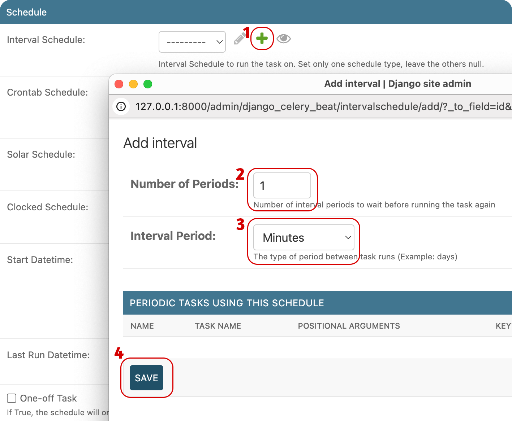


5. Save.

    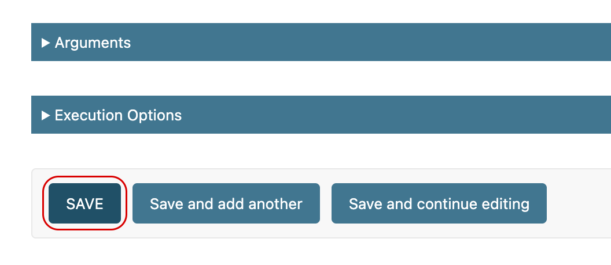


6. Repeat the process for `borrowings.tasks.send_overdue_alert_message_task` but with `1 day` interval.

<br>

## 🤖 &nbsp; Telegram bot
`@Library_Yrarbil_bot` 

<br>

<br>


## 📡 &nbsp; Available Endpoints

- Admin panel: `/admin/`
<br>

- Register a new user: `/api/users/`
- Obtain refresh and access tokens: `/api/users/token/`
- Refresh token: `/api/users/token/refresh/`
- Verify token: `/api/users/token/verify/`
- View user information: `/api/users/me/`
<br>

- Books list: `/api/books/`
- Book detail: `/api/books/<id>/`
<br>

- Borrowings list: `/api/borrowings/`
- Borrowing detail: `/api/borrowings/<id>/`
- Return borrowing: `/api/borrowings/1/return/`
<br>

- Payments list: `/api/payments/`
- Pyment detail: `/api/payments/<id>/`
- Renew expired payment: `/api/payments/1/renew/`

>**Example:** `http://127.0.0.1:8000/api/books/`

<br>

## 📑 &nbsp; API Documentation
- Swagger: `/api/schema/swagger-ui/`
- Redoc: `/api/schema/redoc/`
- Download the API schema: `/api/schema/`

>**Example:** `http://127.0.0.1:8000/api/schema/swagger-ui/`

<br>

## 👾 &nbsp; Features
- JWT-based authentication.
- Login with `email` instead of `username`.
- Admin panel accessible at `/admin/`.
- API documentation with Swagger and Redoc.
- To prevent data loss, media files and the database are stored inside Docker volumes.
- `wait_for_db` feature to ensure the database is ready before starting services.
- Customers can only view their own borrowings and payments.
<br>

- **Filtering**
  - Customers can filter borrowings by `is_active`. Example: `/?is_active=(true or false)`.
  - Staff can filter borrowings by `is_active` and `user_id`. Example: `/?is_active=(true or false)&user_id=<id>`.
<br>

- **Validation**
  - Protection against duplicate book and author combinations.
  - Prevents creating a borrowing if:
    - No copies of the book are available. 
    - The expected return date is earlier than the borrowing date. 
    - The customer has unpaid borrowings or overdue payments. 
<br>

- **Telegram bot notifications for key events**
  - Borrowing and returning books.
  - Daily reminders for return deadlines and overdue alerts (handled with Celery periodic tasks).
  - Unpaid checkout sessions.
  - Payment confirmations.
<br>

- **Payments**
  - Payments are processed through Stripe.
  - Automatic checkout session creation for each borrowing transaction.
  - Additional checkout session creation during the return process if the customer has overdue fees.


<br>

## 🔗 &nbsp; Database diagram
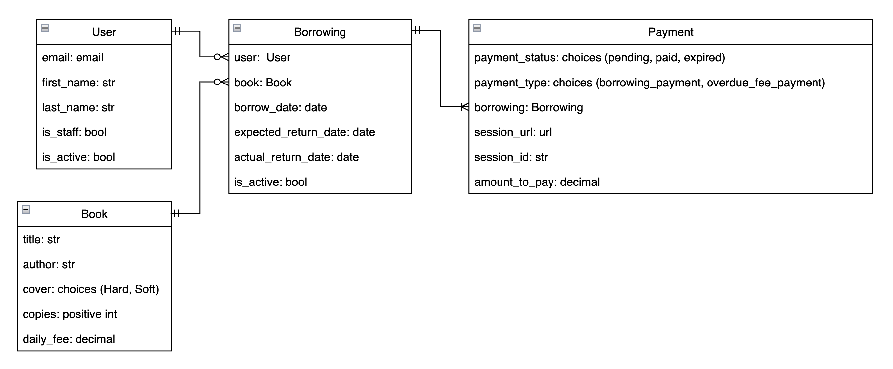

<br>

## 🖥️ &nbsp; Screenshots
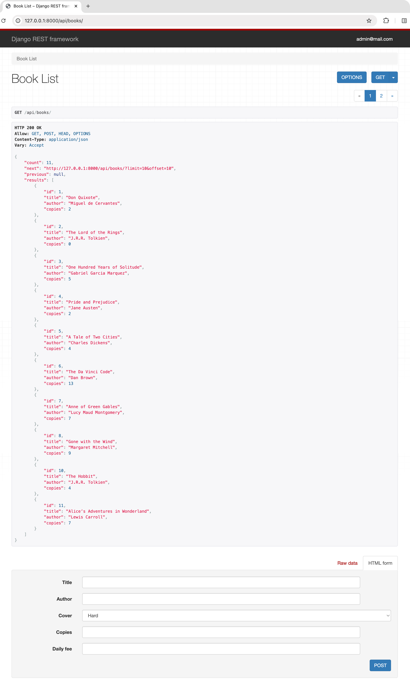

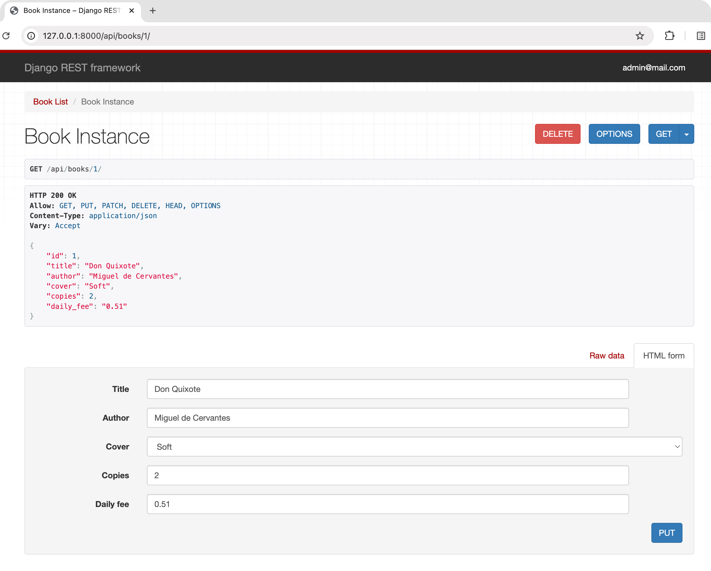

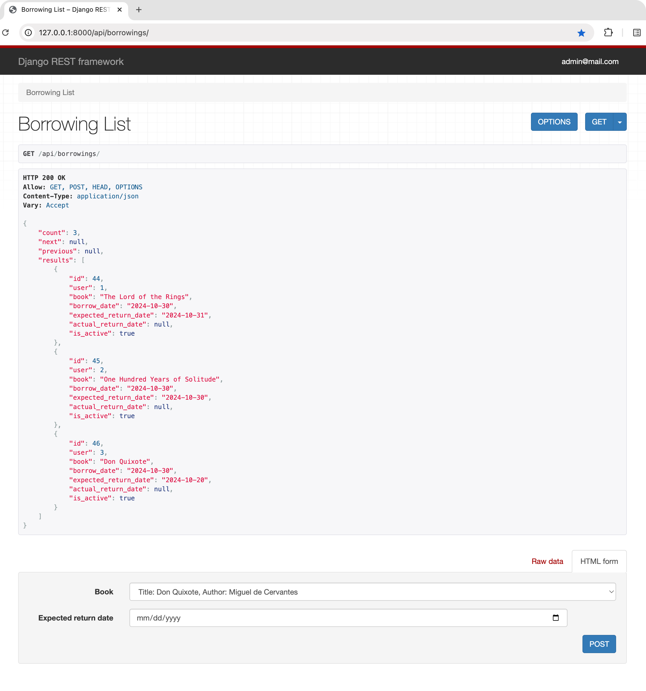

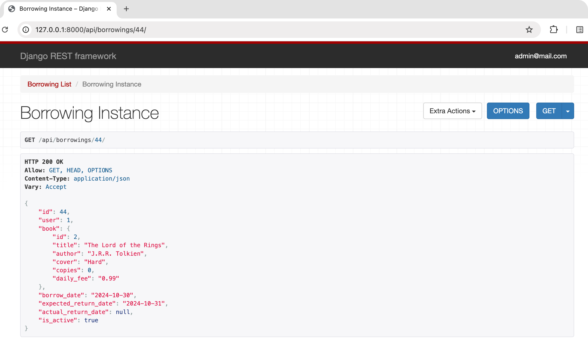

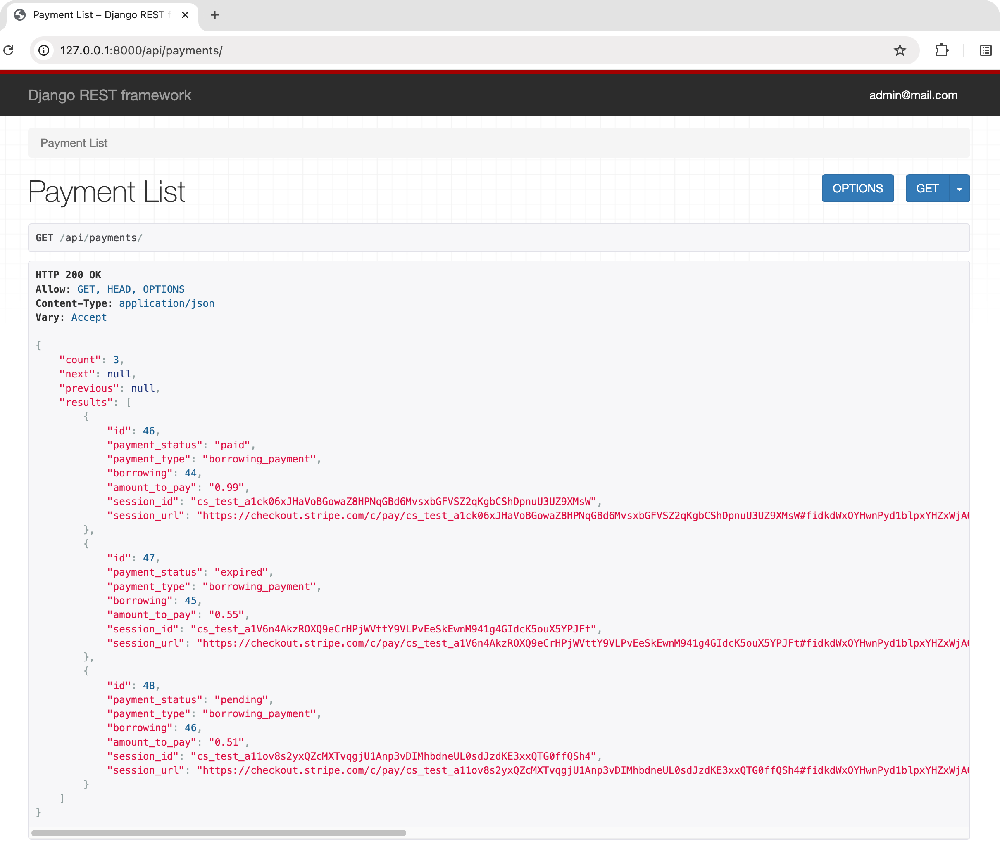

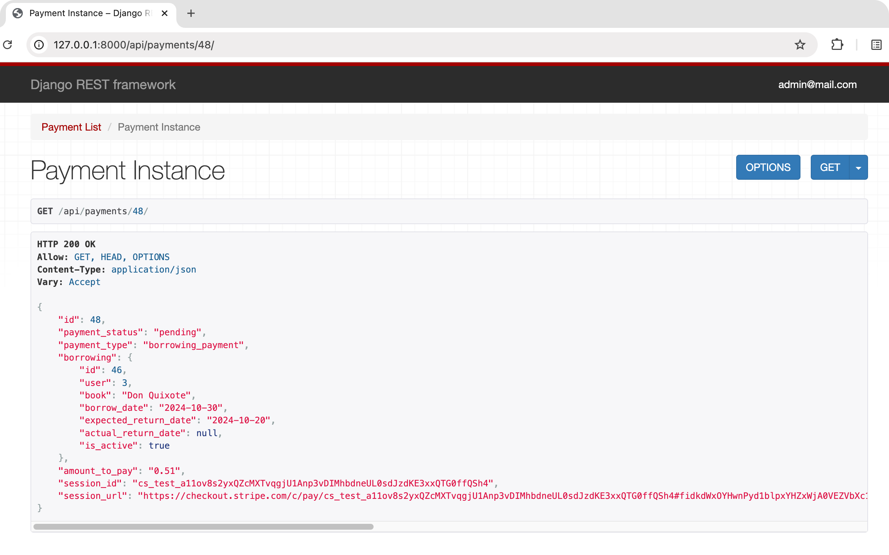

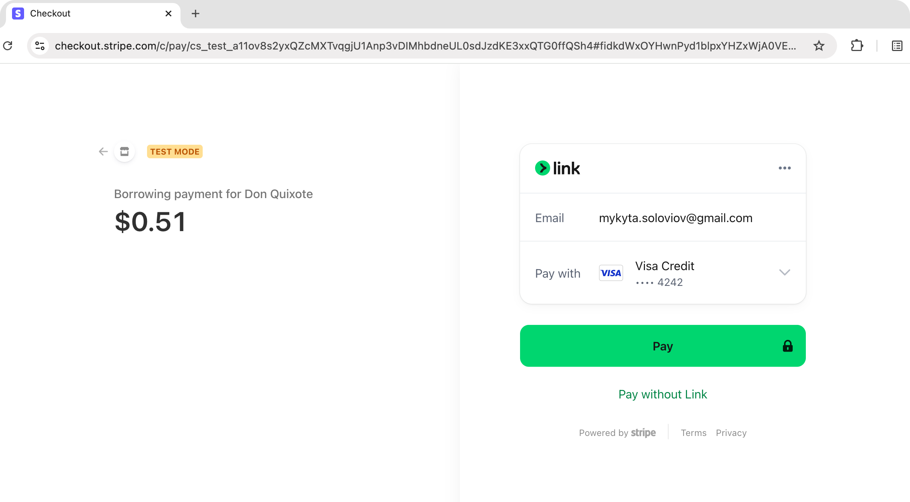

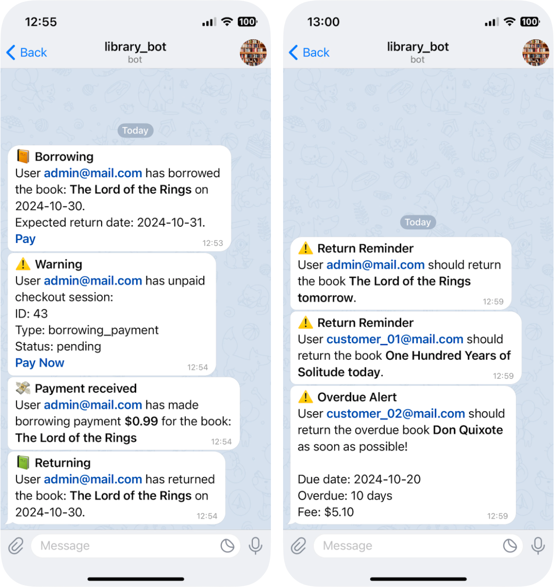


<br>


## ⛙ &nbsp; Git Workflow
For development, I used the Git Feature Branch Workflow.<br>


<br>


## ✍️ &nbsp; Author
 Mykyta Soloviov <a href="https://github.com/mykytaso">@mykytaso</a>
